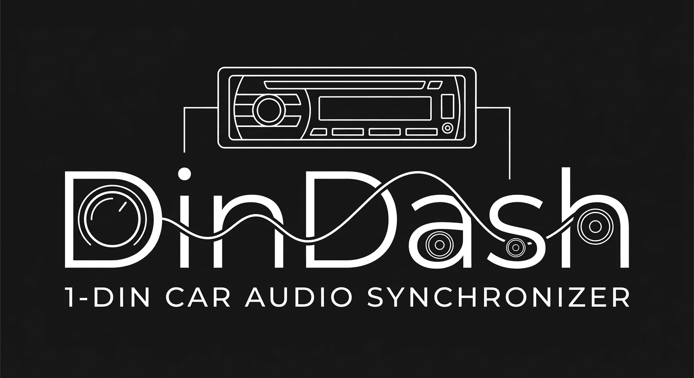

# DinDash 🚗💨

<div align="center">
  
  <p><i>1-DIN CAR AUDIO SYNCHRONIZER</i></p>
</div>

[English](./README.md) | [中文版]

> **針對 1-DIN 車用音響主機的 MP3 自動化預處理工具**

**DinDash** 是一個專為老舊車用硬體設計的高效同步工具。它能將複雜的音樂資料夾結構「扁平化」，並處理那些讓 1-DIN 主機（非 Android 系統）頭痛的亂碼與排序問題。

## 🎯 解決兩大核心困擾

1.  **檔名亂碼與長度限制**：
    * **痛點**：1-DIN 螢幕通常只有 8-12 個字元，且不支援中文。
    * **解法**：自動提取路徑中的數字編號（如 `01-05.mp3`），確保顯示精簡且排序正確。
2.  **ID3 Tag 顯示崩潰**：
    * **痛點**：雜亂的 Artist、Album 標籤或封面圖常導致主機讀取緩慢甚至當機。
    * **解法**：強制清理（Strip）所有標籤資訊，僅將 `Title` 設為數字編號，達成 100% 相容性。


## 🚀 效能表現

* **手動操作**：約 10-15 分鐘（搬移、改名、清理 Tag）。
* **DinDash**：**約 6 秒**（自動化處理完成）。
* **macOS 友善**：執行結束後自動呼叫 `dot_clean`，移除擾人的 `._` 隱藏檔案。

## 🛠 系統需求

本工具依賴於 Go 環境與 [Kid3 - Audio Tag Editor](https://kid3.kde.org/) 的命令列界面。

### 安裝方式 (macOS)

```bash
brew install kid3
```

## 📦 安裝與編譯

你可以選擇直接執行原始碼，或編譯為單一執行檔。

- 方法 A：直接執行
```bash
go run main.go -src [來源路徑] -dest [目的地路徑]
```

- 方法 B：編譯為執行檔

1. 編譯：
  ```bash
  go build -o dindash main.go
  ```

2. (選配) 移動至系統路徑以便隨處執行：
  ```bash
  mv dindash /usr/local/bin/
  ```

3. 執行：
  ```bash
  dindash -src ~/Music -dest /Volumes/USB
  ```

## 📖 使用說明

使用 flag 參數指定來源與目的地：

```bash
./dindash -src [音樂資料夾路徑] -dest [目的地路徑]
```

範例

```bash
./dindash -src ~/Documents/MP3 -dest /Volumes/USB_DISK/MP3_temp
```

## ⚙️ 處理邏輯

1. 路徑分析：取得相對路徑並排除副檔名中的數字。

2. 數字命名：提取路徑中所有數字並以 - 連結作為新檔名。

3. 重複檢查：目的地若已存在相同檔案則自動跳過，節省寫入時間。

4. ID3 Tag 清理：

  - Title: 設為數字新檔名。

  - Artist / Album: 全部清空，極小化檔案體積。

5. 磁碟清理：呼叫 macOS dot_clean 確保 USB 無垃圾檔案。
